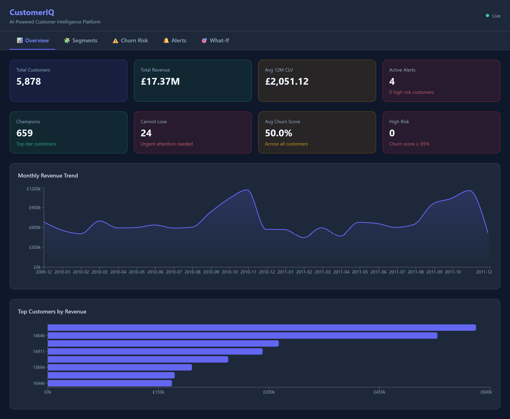
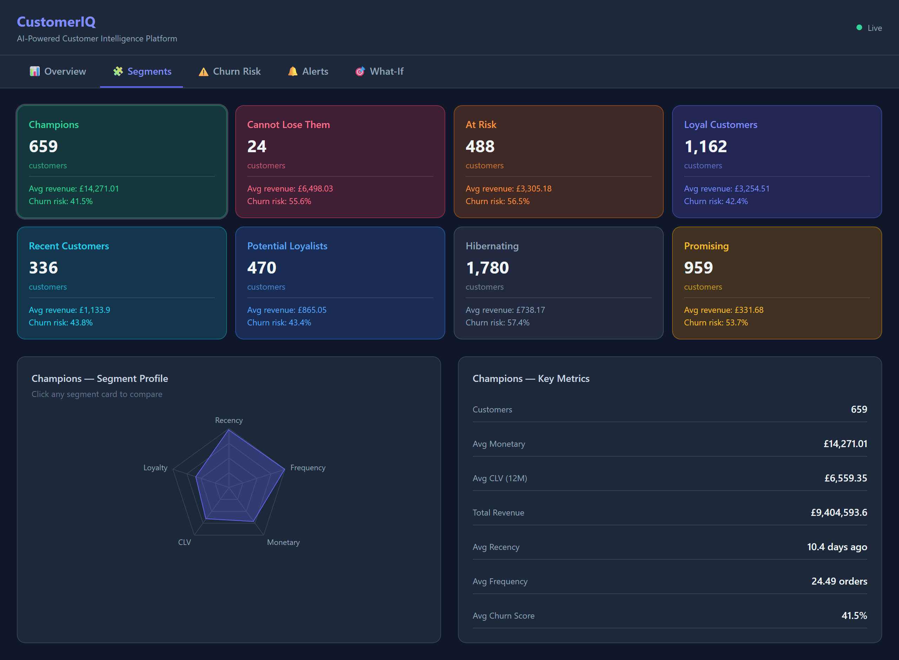
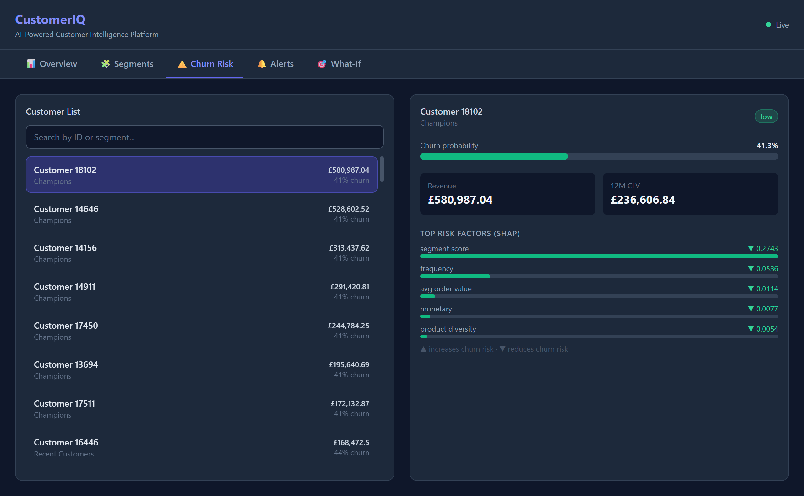
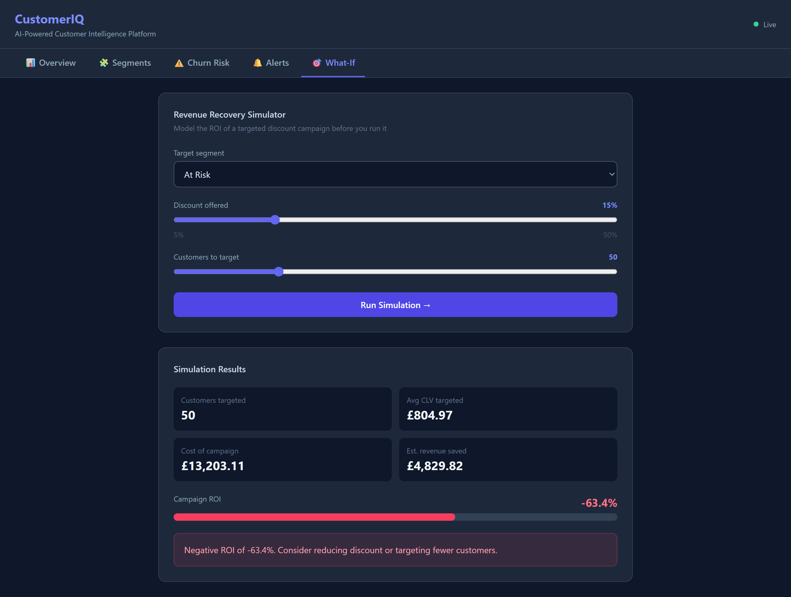

# CustomerIQ — AI-Powered Customer Intelligence Platform

[](https://github.com/ArjunHirani/customer-intelligence-platform/actions/workflows/ci.yml)


> An end-to-end customer analytics SaaS platform — real-time churn prediction, customer lifetime value forecasting, anomaly detection, and a live React dashboard. Built from scratch on 779K+ real retail transactions.

---

## 🔗 Live Demo

| | Link |
|---|---|
| 🖥️ **Live Dashboard** | [customer-intelligence-platform-cyan.vercel.app](https://customer-intelligence-platform-cyan.vercel.app/) |
| ⚡ **API (Swagger docs)** | [customers-intelligence-platform.onrender.com/docs](https://customers-intelligence-platform.onrender.com/docs) |
| 📊 **API Health** | [customers-intelligence-platform.onrender.com/health](https://customers-intelligence-platform.onrender.com/health) |

> ⚠️ First load may take 30–60 seconds — Render free tier sleeps after inactivity.

---

## 🎯 What Problem Does This Solve?

E-commerce and SaaS companies lose millions in revenue to customer churn — and most don't know which customers are about to leave, what they're worth, or what it would cost to retain them.

**CustomerIQ solves this** by ingesting raw transaction data, engineering behavioral features in real time, scoring every customer with production-grade ML models, and surfacing actionable retention insights through a live dashboard — the same workflow used by enterprise products like Clevertap, MoEngage, and Segment, which charge ₹50L+ per year.

---

## 📸 Dashboard Screenshots

### Overview — Revenue trends, KPIs, top customers


### Segments — 8 RFM segments with radar analysis


### Churn Risk — Per-customer SHAP explainability


### What-If Simulator — Campaign ROI before you spend


---

## 🏗️ System Architecture

```
779K+ Transactions (Online Retail II Dataset)
              ↓
    Apache Kafka (3 topics)
    raw-transactions | behavioral-events | alert-triggers
              ↓
    Feature Engineering Pipeline
    RFM scores · Behavioral metrics · Spend trends
              ↓
    Redis Feature Store (sub-second reads)
              ↓
    ┌─────────────────────────────────┐
    │           ML Models             │
    │  XGBoost Churn  (AUC 0.985)     │
    │  BG/NBD + Gamma-Gamma CLV       │
    │  Isolation Forest Anomaly       │
    └─────────────────────────────────┘
              ↓
    FastAPI REST API (15 endpoints)
              ↓
    React + Tailwind Dashboard
    Overview · Segments · Churn · Alerts · What-If
```

## ⚙️ Tech Stack

| Layer | Technology | Why |
|---|---|---|
| Language | Python 3.11 | Best ML ecosystem |
| Data warehouse | PostgreSQL 15 (Neon) | Industry standard, serverless |
| Feature store | Redis 7 | Sub-millisecond feature reads |
| Message broker | Apache Kafka 3.7 | Real-time event streaming |
| Churn model | XGBoost + SHAP | Explainable ML, industry standard |
| CLV model | BG/NBD + Gamma-Gamma | Same algorithm used by Shopify |
| Anomaly detection | Isolation Forest | Unsupervised, no labels needed |
| API | FastAPI + Pydantic | Auto Swagger docs, type-safe |
| Frontend | React 18 + Tailwind + Recharts | Modern, responsive, fast |
| Containerization | Docker + Docker Compose | One command to run everything |
| CI/CD | GitHub Actions | 33 tests, green on every push |
| Deployment | Render (API) + Vercel (Frontend) | Free tier, production-grade |

---

## 📊 Project Stats

| Metric | Value |
|---|---|
| Raw transactions processed | 779,425 |
| Unique customers | 5,878 |
| Total revenue analysed | GBP 17,374,804 |
| RFM segments | 8 |
| Churn model AUC-ROC | 0.9852 |
| Cross-validation AUC | 0.9818 ± 0.0031 |
| Avg predicted 12M CLV | GBP 2,051 |
| Anomalies detected | 294 customers (5%) |
| REST API endpoints | 15 |
| Test coverage | 33 tests passing |
| CI pipeline | GitHub Actions ✅ |

---

## 🖥️ Dashboard Features

### 📊 Overview Tab
- 8 KPI cards — total customers, revenue, avg CLV, active alerts, champions, cannot-lose, churn score, high risk
- Monthly revenue trend area chart (2009–2011 real data)
- Top 8 customers by revenue horizontal bar chart

### 🧩 Segments Tab
- All 8 RFM segments with customer counts, avg revenue, churn risk
- Interactive radar chart showing segment profile across 5 dimensions
- Detailed metrics panel — avg CLV, total revenue, recency, frequency
- Click any segment to compare profiles instantly

### ⚠️ Churn Risk Tab
- 100 highest-revenue customers with live churn scores
- Search by customer ID or segment name
- Per-customer SHAP waterfall chart — shows exactly WHY a customer is at risk
- Churn probability bar (red/amber/green) + risk badge
- 12-month CLV alongside churn score

### 🔔 Alerts Tab
- Live anomaly alerts from Isolation Forest model
- Severity-based sorting (high → medium → low)
- One-click resolve with instant UI update
- Segment drift detection and high-value customer warnings

### 🎯 What-If Revenue Simulator
- Select any of 8 segments as target
- Drag discount % slider (5%–50%)
- Drag customers-to-target slider (5–200)
- Instant ROI calculation — cost of campaign vs estimated revenue saved
- Business recommendation text (run it / reduce discount / avoid)

---

## 🚀 Running Locally

### Prerequisites
- Python 3.11
- Docker Desktop
- Node.js 18+
- Git

### 1. Clone and set up environment

```bash
git clone https://github.com/ArjunHirani/customer-intelligence-platform.git
cd customer-intelligence-platform
python -m venv venv
venv\Scripts\activate          # Windows
pip install -r backend/requirements.txt
```

### 2. Start infrastructure (PostgreSQL + Redis + Kafka)

```bash
docker compose up -d
```

### 3. Download dataset

Download [Online Retail II](https://www.kaggle.com/datasets/mashlyn/online-retail-ii-uci) from Kaggle and place at:
backend/data/raw/online_retail_II.csv

### 4. Run the full pipeline

```bash
cd backend
python src/ingestion/csv_loader.py       # Load 779K transactions
python src/features/rfm.py               # Compute RFM segments
python src/features/feature_store.py     # Populate Redis
python src/models/churn_model.py         # Train XGBoost (AUC 0.985)
python src/models/clv_model.py           # Train BG/NBD CLV
python src/models/anomaly_model.py       # Train Isolation Forest
```

### 5. Start the API

```bash
uvicorn src.api.main:app --host 0.0.0.0 --port 8000 --reload
```
→ Swagger docs at `http://localhost:8000/docs`

### 6. Start the frontend

```bash
cd frontend
npm install
npm run dev
```
→ Dashboard at `http://localhost:5173`

---

## 🧪 Tests

```bash
cd backend
python -m pytest tests/ -v
```
33 passed in 5.66s ✅

Test coverage:
- `test_features.py` — RFM computation, segmentation logic
- `test_models.py` — Model file integrity, AUC threshold, prediction shape
- `test_api.py` — All 15 endpoints, pagination, 404 handling, what-if simulation

---

## 📁 Project Structure

```
customer-intelligence-platform/
├── backend/
│   ├── src/
│   │   ├── ingestion/         # Kafka producers, CSV loader
│   │   │   ├── csv_loader.py
│   │   │   ├── kafka_producer.py
│   │   │   └── event_simulator.py
│   │   ├── features/          # RFM, behavioral, Redis feature store
│   │   │   ├── rfm.py
│   │   │   ├── behavioral.py
│   │   │   └── feature_store.py
│   │   ├── models/            # Churn, CLV, anomaly models
│   │   │   ├── churn_model.py
│   │   │   ├── clv_model.py
│   │   │   └── anomaly_model.py
│   │   ├── api/               # FastAPI routers and schemas
│   │   │   ├── main.py
│   │   │   ├── schemas.py
│   │   │   └── routers/
│   │   └── utils/             # DB, Redis, logger
│   ├── tests/                 # 33 pytest tests
│   └── models_saved/          # Trained .pkl model files
├── frontend/
│   └── src/
│       ├── components/        # 5 dashboard tab components
│       └── api/               # Axios client
├── sql/
│   └── schema.sql             # PostgreSQL schema (6 tables)
├── kafka/
│   └── create_topics.sh       # Kafka topic setup
├── docker-compose.yml         # Full local infrastructure
└── .github/workflows/ci.yml   # GitHub Actions CI
```

## 🔌 API Endpoints

| Method | Endpoint | Description |
|---|---|---|
| GET | `/health` | Service health check |
| GET | `/customers/` | List customers with filters |
| GET | `/customers/{id}` | Full customer profile |
| GET | `/customers/{id}/risk` | Churn score + SHAP explanation |
| GET | `/customers/{id}/events` | Behavioral event history |
| GET | `/segments/` | All 8 RFM segments with KPIs |
| GET | `/segments/{name}/customers` | Customers in a segment |
| GET | `/segments/{name}/history` | 90-day segment trend |
| GET | `/alerts/` | Active anomaly alerts |
| PATCH | `/alerts/{id}/resolve` | Resolve an alert |
| POST | `/simulate/what-if` | Campaign ROI simulator |
| GET | `/analytics/overview` | Headline KPIs |
| GET | `/analytics/revenue-trend` | Monthly revenue time series |
| GET | `/analytics/cohort-retention` | Cohort retention matrix |
| GET | `/analytics/top-customers` | Top customers by revenue |

---

## 👨‍💻 Author

**Arjun Hirani**
 B.Tech Electronics and Communication Engineering, Nirma University (2024–2028)

[](https://www.linkedin.com/in/arjun-hirani-949494381/)
[](https://github.com/ArjunHirani)

---

## ⭐ Star this repo if you found it useful!
